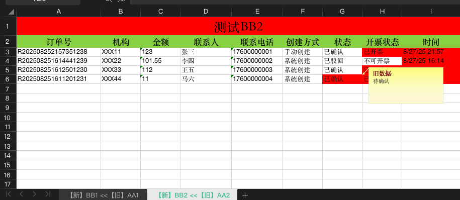

 [[toc]]

# Diff Excel 简单高效的 Excel 差异对比工具
简单高效的 Excel 差异对比工具

GitHub 项目地址：https://github.com/zbuzhi/diff-excel

# 核心功能
Excel文件对比：支持对比两个Excel文件的差异

多Sheet对比：支持选择多对Sheet同时对比，一对一映射，任意搭配

格式保持：可选择保持原始文件Sheet的单元格格式（单元格大小、合并单元格、字体样式等）

差异高亮：使用颜色高亮显示不同的单元格

备注功能：可在差异单元格中添加备注显示原始内容

自定义颜色：支持自定义差异高亮颜色

# 技术特点
模块化架构：清晰的文件结构，易于维护和扩展
GUI界面：基于Fyne框架的直观用户界面
跨平台：支持Windows、macOS、Linux
高性能：支持大型Excel文件处理